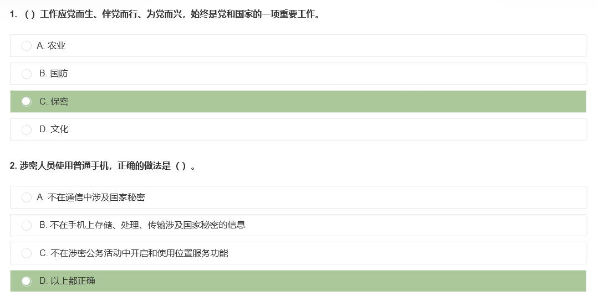

# 1. 简介

显示中国保密在线考试答案的脚本，用黄色突出正确选项

# 2. 安装

如果你还没有安装 Tampermonkey，请查看相关博客：[各大浏览器中的 Tampermonkey（油猴子）插件安装使用全攻略](https://zhuanlan.zhihu.com/p/52182666)

点击此处安装脚本：[https://greasyfork.org/en/scripts/496558/显示中国保密在线考试答案.user.js](https://update.greasyfork.org/scripts/496558/%E6%98%BE%E7%A4%BA%E4%B8%AD%E5%9B%BD%E4%BF%9D%E5%AF%86%E5%9C%A8%E7%BA%BF%E8%80%83%E8%AF%95%E7%AD%94%E6%A1%88.user.js)

# 3. 相关网站

- Greasy Fork 插件主页: [https://greasyfork.org/en/scripts/496558](https://greasyfork.org/en/scripts/496558)
- 中国保密在线: http://www.baomi.org.cn

# 4. License

MIT
